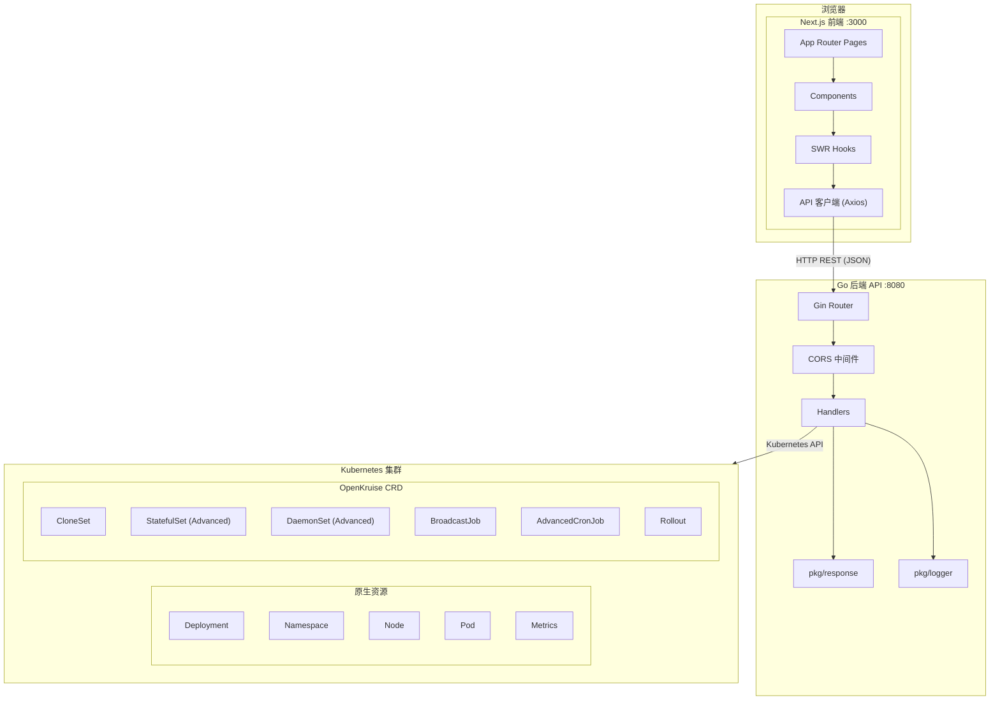
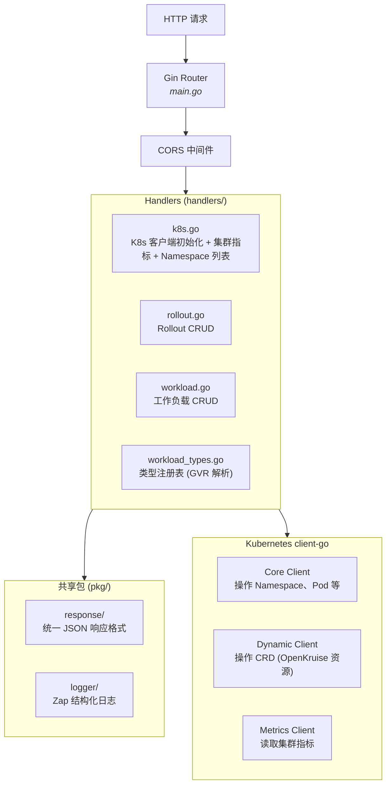
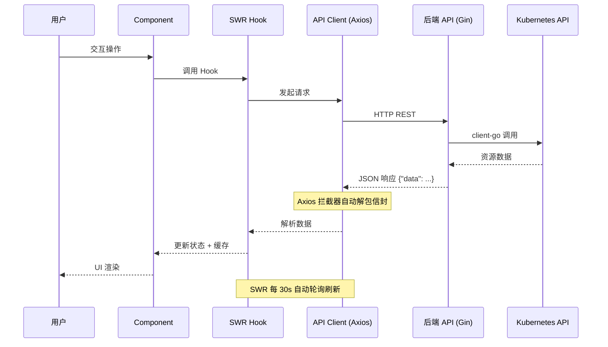

# 系统架构

## 整体架构



## 后端架构

### 分层设计



### 环境变量加载

后端使用 [godotenv](https://github.com/joho/godotenv) 在 `main()` 启动时自动加载 `openkruise-backend/.env` 文件。如果文件不存在则使用系统环境变量。

### Kubernetes 客户端

后端使用三种 Kubernetes 客户端：

- **Core Client**：用于操作原生 Kubernetes 资源（Namespace、Pod、Node 等）
- **Dynamic Client**：用于操作 OpenKruise 自定义资源（CloneSet、StatefulSet 等），通过 GVR（Group-Version-Resource）动态查询，不依赖编译时的类型定义
- **Metrics Client**：用于查询集群节点的 CPU、内存等资源使用指标

客户端在应用启动时通过 `handlers.InitK8sClient()` 初始化为单例，整个生命周期复用。

### 工作负载类型注册表

`workload_types.go` 定义了一个类型注册表，将工作负载类型字符串映射到 Kubernetes GVR：

```go
type WorkloadTypeInfo struct {
    GVR         schema.GroupVersionResource
    Kind        string
    Scalable    bool       // 是否支持扩缩容
    Restartable bool       // 是否支持重启
}
```

这一设计使得添加新工作负载类型仅需在注册表中增加一条记录，无需修改 handler 逻辑。

### 统一响应格式

所有 API 响应通过 `pkg/response` 标准化：

- 成功响应：`{"data": ...}`
- 错误响应：`{"trace_id": "...", "message": "...", "code": "..."}`

错误响应包含唯一 `trace_id`，便于日志关联和问题排查。

## 前端架构

### 分层设计



```mermaid
graph TB
    URL["浏览器 URL"] --> AppRouter

    subgraph AppRouter["App Router (app/)"]
        Layout["layout.tsx — 全局布局 + NamespaceProvider"]
        PageHome["page.tsx — Dashboard 首页"]
        PageWorkload["workloads/[type]/[namespace]/[name]/ — 工作负载详情页"]
        PageRollout["rollouts/[namespace]/[name]/ — Rollout 详情页"]
    end

    AppRouter --> Comps

    subgraph Comps["Components (components/)"]
        DashComps["dashboard-page.tsx — 布局 + NamespaceSelector"]
        NsComps["namespace-*.tsx — Namespace Provider & Selector"]
        WorkloadComps["workload-*.tsx — 工作负载组件"]
        RolloutComps["rollout-*.tsx — Rollout 组件"]
        Overview["overview.tsx — 集群概览"]
        UI["ui/ — shadcn/ui 原子组件"]
    end

    Comps --> SWR

    subgraph SWR["SWR Hooks (hooks/)"]
        UseNamespace["use-namespace.ts — Namespace 上下文 + 列表"]
        UseCluster["use-cluster.ts — 集群指标 (30s 轮询)"]
        UseWorkloads["use-workloads.ts — 工作负载列表 & 详情"]
        UseRollouts["use-rollouts.ts — Rollout 列表 & 详情"]
    end

    SWR --> Api

    subgraph Api["API Client (api/)"]
        AxiosInst["axiosInstance.ts — Axios 配置 + 响应信封解包"]
        NsApi["namespace.ts — Namespace 列表 API"]
        ClusterApi["cluster.ts — 集群 API"]
        WorkloadApi["workload.ts — 工作负载 API"]
        RolloutApi["rollout.ts — Rollout API"]
    end

    Api --> Lib

    subgraph Lib["Configuration (lib/)"]
        Config["config.ts — 环境变量读取"]
        Utils["utils.ts — 通用工具"]
    end
```

### Namespace 全局状态

前端通过 React Context 管理全局 Namespace 状态：

1. `NamespaceProvider`（`namespace-provider.tsx`）在 `layout.tsx` 中包裹整个应用
2. `NamespaceSelector`（`namespace-selector.tsx`）作为全局下拉选择器展示在导航栏
3. 各页面通过 `useNamespace()` hook 获取当前选中的命名空间
4. SWR hooks（`use-workloads.ts`、`use-rollouts.ts`）自动响应命名空间切换刷新数据

### 数据流



### SWR 缓存策略

前端使用 SWR 进行数据请求管理：

- **自动轮询**：列表页每 30 秒自动刷新
- **缓存优先**：显示缓存数据的同时在后台重新获取
- **错误处理**：SWR 自动处理请求失败和重试
- **Key 管理**：基于命名空间和资源名称生成唯一的缓存键

### 组件设计

- **Server Components**：默认使用，用于页面布局和不需要交互的内容
- **Client Components**：需要用户交互、浏览器 API 或状态管理的组件使用 `"use client"`
- **shadcn/ui**：基于 Radix UI 的无样式原语 + Tailwind CSS 构建的可定制组件库

## Monorepo 结构

项目使用 **pnpm workspace** 管理前端依赖：

- 根目录 `pnpm-workspace.yaml` 定义 `openkruise-dashboard` 为 workspace 包
- `pnpm install` 在根目录运行，依赖 store 在 `node_modules/.pnpm/`
- `next.config.ts` 中 `turbopack.root` 指向父目录（monorepo root），因为 Turbopack 从 git root 解析 CSS 模块
- `.gitignore` 统一在项目根目录管理，子目录不维护独立的 `.gitignore`

## 通信协议

前后端通过 HTTP REST API 通信：

- **协议**：HTTP（开发环境），建议生产环境使用 HTTPS
- **数据格式**：JSON
- **响应信封**：所有成功响应包裹在 `{"data": ...}` 中，前端 Axios 拦截器自动解包
- **CORS**：后端通过 `ALLOWED_ORIGINS` 环境变量配置允许的前端源
- **超时**：前端 Axios 默认 10 秒超时

## 目录导航

- [API 接口参考](api.md)
- [部署指南](deployment.md)
- [项目主页](../README.md)
